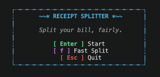

# Receipt Splitter

A Python CLI app for splitting receipts between people.


### About
Receipt Splitter takes validated inputs for receipt details, splits by shares, applies a robust 
rounding algorithm to calculate everyone's totals and displays a formatted receipt that can be exported to .png.


### New Features
**v0.4.0 (current ver.) — More Powerful Splitting**
- Unequal splitting by shares introduced in Normal Split
- New Fast Split mode for faster splitting
- Introduce export to .png file for each mode (saved to current directory)
- ↓ New animated start menu to choose mode

<!--  -->


## Installation

↓ Install the latest version from PyPI
<small><pre style="display: inline-block; margin: 0;"><code>pip install receipt-splitter
</code></pre></small>

↓ Run the interactive CLI and follow the prompts!
<small><pre style="display: inline-block; margin: 0;"><code>receipt-splitter
</code></pre></small>

## Splitting

### Fast Split 🚀
- Add each item and sharing details in one line
  <small>
  <pre style="display: inline-block; margin: 0;">
  > pizza, 9.99, alice, bob, charlie
  </pre>
  </small>
- Minimal inputs and validation for faster splitting
- Split in under 30 seconds
- Equal weighting for each person
- Option to add extra charges and custom labels
  <small>
  <pre style="display: inline-block; margin: 0;">
  > 12.5%, 5 tip
  </pre>
  </small>


### Normal Split
- Add people and items separately
- Comprehensive input validation
- Confirm and edit people and items at each stage
- Assign each item to the people who shared it
- Edit who shared which item
- Assign custom shares for unequal splitting
- Add a percentage service charge
- Add any extra charges with optional custom labels

<br>

**Example Receipt**

<table><tr><td>

```text
=============================================
                   RECEIPT                   
=============================================

Alice, Bob, Charlie

---------------------------------------------
pizza                                £ 9.99
  Shared by: Alice, Bob, Charlie
chips                                £ 5.50
  Shared by: Alice (2), Bob (1)
drinks                              £ 15.00
  Shared by: Alice, Bob, Charlie
---------------------------------------------
Subtotal                            £ 30.49
Service charge (12.5%)               £ 3.81
Tip                                  £ 5.00

---------------------------------------------
Total                               £ 39.30


AMOUNT OWED
---------------------------------------------
Alice                               £ 15.16
Bob                                 £ 13.10
Charlie                             £ 11.04
---------------------------------------------
Total                               £ 39.30
---------------------------------------------
```
</td></tr></table>


## Future Features
- Finalise CLI functionality
- Introduce Image Split
- Web application